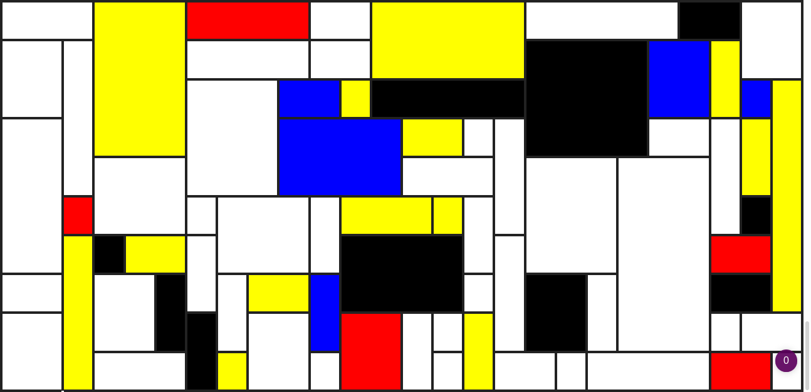

# JS-DOMondrian -- An exercice on manipulating the DOM and randomizing tables and cell merging

This exercice to simulate a Mondrian painting with HTML tables and JavaScript to randomize its creation was done as part of a JS course in Nov. 2021.

It refreshes every second (through the HTML meta tag; but the code is there and commented to make it through JS).

Here's what it looks like:

